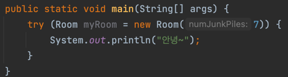

## 아이템 8. finalizer와 cleaner 사용을 피하라

### 객체 소멸자인 finalizer와 cleaner

- 객체가 가비지 컬렉션에 의해 수거되기 전에 객체의 정리(clean-up) 작업을 수행
- finalizer
    - 예측X, 일반적으로 불필요함
- cleaner
    - finalizer보다 덜 위험하지만 여전히 예측 불가, 느림 → 불필요
- C++의 destructor와 다름
- finalizer와 cleaner로는 제때 실행되어야 하는 작업은 절대 할 수 없다.
    - 실행 시점을 판단할 수 없기 때문
- finalizer 스레드는 다른 애플리케이션 스레드보다 우선 순위가 낮아서 실행 기회를 제대로 얻지 못함 → 안쓰는게 답
- cleaner는 그나마 낫지만 여전히 가비지 컬렉터의 통제 하에 있어서 즉각 수행된다는 보장이 없음

### 다양한 문제점

- 상태를 영구적으로 수정하는 작업에서는 절대 finalizer, cleaner에 의존하면 안된다.
    - 데이터베이스의 영구 락(lock) 해제를 finalizer나 cleaner에게 맡겨 놓으면 분산 시스템 전체가 서서히 멈춤
- finalizer 동작 중 발생한 예외는 무시된다. 처리할 작업이 남아도 종료된다.
    - 그나마 cleaner는 이런 문제가 발생하지는 않는다.
- 심각한 성능 문제
    - AutoCloseable 객체 (try-with-resources 사용): 12ns
    - finalizer: 550ns
- 심각한 보안 문제
    - 생성자나 직렬화 과정에서 예외가 발생하면, 악의적인 하위 클래스의 finalizer가 수행될 수 있게 됨
    - final이 아닌 클래스를 finalizer 공격으로부터 방어하려면, 그냥 finalize 메서드를 만들고 final로 선언하기

### 그렇다면 어떻게 해야되나?

- AutoCloseable 구현
    - 클라이언트에서 인스턴스를 다 쓰고 나면 close 메서드 호출 → 일반적으로 **try-with-resources 사용**
    - close 메서드에서 이 객체는 더 이상 유효하지 않음을 필드에 기록, 다른 메서드는 이 필드를 검사하여 객체가 닫힌 후에 불리면 예외 던지는 형식

### 그럼 finalizer 와 cleaner는 왜 쓰는걸까?

1. 자원의 소유자가 close 메서드를 호출하지 않는 것에 대비한 안전망
    - 안하는 것보다 늦게라도 해주는게 나으니까
2. 네이티브 피어와 연결된 객체
    - 네이티브 피어
      - 일반 자바 객체가 네이티브 메서드를 통해 기능을 위임한 네이티브 객체
        - 네이티브 메서드: Java 언어 외부에서 작성된 코드를 Java 프로그램에서 호출할 수 있는 메서드
    - 가비지 컬렉터는 자바 객체가 아니라 그 존재를 모름

### try-with-resources

- 이런 식으로 코드를 짜면 된다.
- try-with-resources를 사용하지 않는 코드에서는 System.exit을 호출할 때 청소가 이뤄진다는 보장은 없다.

### 정리

- cleaner는 안정망 역할 or 중요하지 않은 네이티브 자원 회수용으로만 사용하자