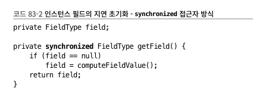

# ITEM 11. HASHCODE 구현 방법

- equals를 재정의한 클래스 모두에서 hashCode도 재정의해야 한다
    - 논리적으로 같은 객체는 같은 해시코드를 반환해야 한다!

```java
package effectivejava.chapter3.item11;
import java.util.*;

// equals를 재정의하면 hashCode로 재정의해야 함을 보여준다. (70-71쪽)
public final class PhoneNumber {
    private final short areaCode, prefix, lineNum;

    public PhoneNumber(int areaCode, int prefix, int lineNum) {
        this.areaCode = rangeCheck(areaCode, 999, "area code");
        this.prefix   = rangeCheck(prefix,   999, "prefix");
        this.lineNum  = rangeCheck(lineNum, 9999, "line num");
    }

    private static short rangeCheck(int val, int max, String arg) {
        if (val < 0 || val > max)
            throw new IllegalArgumentException(arg + ": " + val);
        return (short) val;
    }

    @Override public boolean equals(Object o) {
        if (o == this)
            return true;
        if (!(o instanceof PhoneNumber))
            return false;
        PhoneNumber pn = (PhoneNumber)o;
        return pn.lineNum == lineNum && pn.prefix == prefix
                && pn.areaCode == areaCode;
    }

    // hashCode 없이는 제대로 동작하지 않는다. 다음 셋 중 하나를 활성화하자.

//    // 코드 11-2 전형적인 hashCode 메서드 (70쪽)
//    @Override public int hashCode() {
//        int result = Short.hashCode(areaCode);
//        result = 31 * result + Short.hashCode(prefix);
//        result = 31 * result + Short.hashCode(lineNum);
//        return result;
//    }

//    // 코드 11-3 한 줄짜리 hashCode 메서드 - 성능이 살짝 아쉽다. (71쪽)
//    @Override public int hashCode() {
//        return Objects.hash(lineNum, prefix, areaCode);
//    }

//    // 해시코드를 지연 초기화하는 hashCode 메서드 - 스레드 안정성까지 고려해야 한다. (71쪽)
//    private int hashCode; // 자동으로 0으로 초기화된다.
//
//    @Override public int hashCode() {
//        int result = hashCode;
//        if (result == 0) {
//            result = Short.hashCode(areaCode);
//            result = 31 * result + Short.hashCode(prefix);
//            result = 31 * result + Short.hashCode(lineNum);
//            hashCode = result;
//        }
//        return result;
//    }

    public static void main(String[] args) {
        Map<PhoneNumber, String> m = new HashMap<>();
        m.put(new PhoneNumber(707, 867, 5309), "제니");
        System.out.println(m.get(new PhoneNumber(707, 867, 5309)));
    }
}
```

> 한 줄짜리 hashCode
> 

```java
//    // 코드 11-3 한 줄짜리 hashCode 메서드 - 성능이 살짝 아쉽다. (71쪽)
//    @Override public int hashCode() {
//        return Objects.hash(lineNum, prefix, areaCode);
//    }
```

- 속도는 더 느림
    - 입력 인수를 담기 위한 배열이 만들어짐
    - 기본 타입이 있다면 박싱, 언박싱도 거쳐야함

> 왜 31인가?
> 

사전에 들어있는 모든 단어로 누군가 테스트 해봤는데 31이라는 숫자가 가장 충돌이 적었다. - 연구 결과라고 함

```
곱셈 연산의 효율성: 31은 2^5 - 1로 표현될 수 있는데, 이는 컴퓨터에서 곱셈을 비트 시프트와 뺄셈으로 대체할 수 있음을 의미합니다. 특히, 곱셈이 느린 오래된 시스템이나, 제한된 하드웨어 환경에서는 이 방법이 더 효율적일 수 있습니다.

해시 충돌 최소화: 31은 소수이며, 소수를 해시 함수의 곱셈 요소로 사용하면 해시 충돌을 최소화하는 데 도움이 됩니다.

31은 홀수로서의 역할: 홀수를 곱 하는 것은 값이 중앙에서 벗어나게 하고, 이는 다시 분포를 더 균일하게 만들어 줍니다. 이는 해시 충돌의 수를 줄이는 데 도움이 됩니다.
```

> lombok 사용
> 

```java
@EqualsAndHashCode // 얘를 활용하자
```

이미 Lombok에서 테스트도 다 돌려봤기 때문에 직접 구현보단 Lombok을 이용해서 하는게 공수가 더 적게 든다. (테스트 코드를 하나하나 쓸 필요가 없으니까)

> 해시맵 내부의 연결 리스트
> 

해시 충돌이 발생하면 동일한 버킷에 LinkedList 형태로 구현이 되는데 이 때 탐색 속도는 O(N)이 소요된다. O(1) → O(N)은 엄청난 성능 손실일 수 있다

근데 Java8에서 동일 버킷 내 일정 개수 이상의 엔트리가 추가되면 LinkedList 대신 Red-Black Tree를 사용하게끔 바뀌었다.

- LinkedList: O(N)
- 이진트리: O(logN)

> 근데 왜 하필 LinkedList일까?
> 

ArrayList였다면 공간을 할당시켜놔야 하니까 하나의 레퍼만 필요한 LinkedList를 쓴게 아닐까

→ ArrayList와 LinkedList의 차이에 대한 CS 지식으로 연결될 수 있음

- 메모리 오버헤드
- 삽입/삭제 성능 차이

위 키워드에 대해 답변이 가능해야함

> 구아바 해싱함수?
> 

해싱 자체에 성능 개선이 필요하다는 것은 굉장히 드물다.. 쓸 일 없을 듯하다

보통 성능 개선은 Connection이나 쿼리 성능 개선이 주를 이룬다 그냥 알고만 넘어가자

> 지연 초기화
> 

```java
//    // 해시코드를 지연 초기화하는 hashCode 메서드 - 스레드 안정성까지 고려해야 한다. (71쪽)
//    private int hashCode; // 자동으로 0으로 초기화된다.
//
//    @Override public int hashCode() {
//        int result = hashCode;
//        if (result == 0) {
//            result = Short.hashCode(areaCode);
//            result = 31 * result + Short.hashCode(prefix);
//            result = 31 * result + Short.hashCode(lineNum);
//            hashCode = result;
//        }
//        return result;
//    }
```

- 성능을 고려해야 한다면 캐싱하는 방식 사용
- 하지만 Thread-safe하지 않다

### Thread-Safety 메서드

> items83에서 더 자세히 다룸
> 



```java
private volatile int hashcode;

@Override public int hashCode() {
	if (this.hashCode != 0) {
    return hashCode;
  }

  synchronize(this) {
     // ...
     return result;
  }
}
```

- HashMap, HashTable 차이를 기억해두자. Thread-safe한 차이다.
- Concurrent류를 사용하자