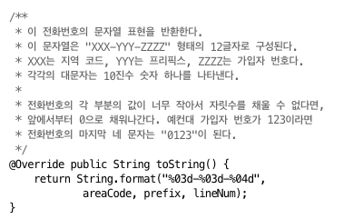
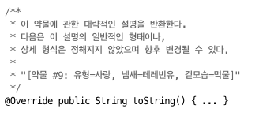

# ITEM 12. toString을 항상 재정의하라

- toString은 간결하면서 **사람이 읽기 쉬운 형태의 유익한 정보**를 반환해야 한다.
- Object의 toString은 **클래스이름@16진수로 표시한 해시 코드**
- 객체가 가진 모든 정보를 보여주는 것이 좋다
- 값 클래스라면 포맷을 문서에 명시하는 것이 좋으며 해당 포맷으로 객체를 생성할 수 있는 정적 팩터리나 생성자를 제공하는 것이 좋다
    
    
    
    
    
- toString이 반환한 값에 포함된 정보를 얻어올 수 있는 API를 제공하는 것이 좋다 ?
- 경우에 따라 AutoValue, 롬복 또는 IDE를 사용하지 않는게 적절할 수 있다

---

```java
package effectivejava.chapter3.item12;

// Adding a toString method to PhoneNumber (page 52)
public final class PhoneNumber {
    private final short areaCode, prefix, lineNum;

    public PhoneNumber(int areaCode, int prefix, int lineNum) {
        this.areaCode = rangeCheck(areaCode, 999, "area code");
        this.prefix   = rangeCheck(prefix,   999, "prefix");
        this.lineNum  = rangeCheck(lineNum, 9999, "line num");
    }

    private static short rangeCheck(int val, int max, String arg) {
        if (val < 0 || val > max)
            throw new IllegalArgumentException(arg + ": " + val);
        return (short) val;
    }

    @Override public boolean equals(Object o) {
        if (o == this)
            return true;
        if (!(o instanceof effectivejava.chapter3.item11.PhoneNumber))
            return false;
        PhoneNumber pn = (PhoneNumber)o;
        return pn.lineNum == lineNum && pn.prefix == prefix
                && pn.areaCode == areaCode;
    }

    @Override public int hashCode() {
        int result = Short.hashCode(areaCode);
        result = 31 * result + Short.hashCode(prefix);
        result = 31 * result + Short.hashCode(lineNum);
        return result;
    }

    /**
     * Returns the string representation of this phone number.
     * The string consists of twelve characters whose format is
     * "XXX-YYY-ZZZZ", where XXX is the area code, YYY is the
     * prefix, and ZZZZ is the line number. Each of the capital
     * letters represents a single decimal digit.
     *
     * If any of the three parts of this phone number is too small
     * to fill up its field, the field is padded with leading zeros.
     * For example, if the value of the line number is 123, the last
     * four characters of the string representation will be "0123".
     */
//    @Override public String toString() {
//        return String.format("%03d-%03d-%04d",
//                areaCode, prefix, lineNum);
//    }

    public static void main(String[] args) {
        PhoneNumber jenny = new PhoneNumber(707, 867, 5309);
        System.out.println("Jenny's number: " + jenny);
    }
}
```

- 사용자가 원하는 포맷이 있을때, 좌표, 위경도, 연락처 등등 → lombok으로 다 해결할 순 없어서 toString을 override 함