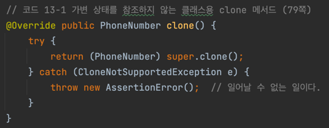
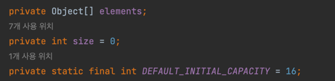
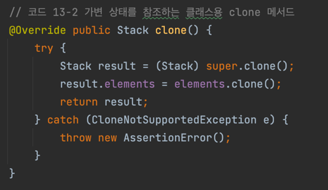
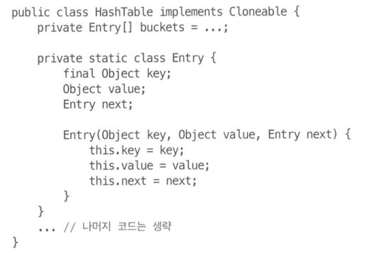
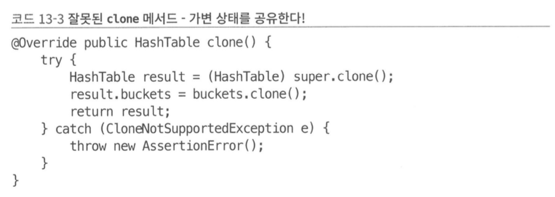
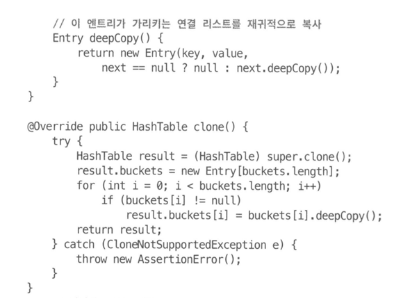
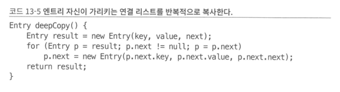
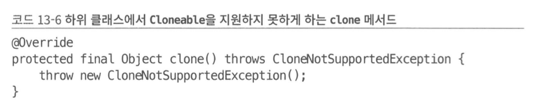
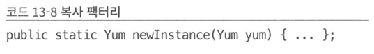

## 아이템 13. clone 재정의는 주의해서 진행해라

### Cloneable 인터페이스의 역할

- Object의 protected 메서드인 clone의 동작 방식을 결정한다.
- Cloneable을 구현한 클래스의 인스턴스에서 clone을 호출하면 그 객체의 필드들을 복사한 객체를 반환
- Cloneable을 구현하지 않은 클래스의 인스턴스에서 호출하면 CloneNotSupportedException 던짐

### clone 메서드의 위험성

- 생성자를 호출하지 않아도 객체를 생성할 수 있게 됨
- 일반 규약이 허술함

### clone 메서드의 허술한 일반 규약

> 객체의 생성본을 반환한다.
>
- x.clone() ≠ x 는 참이다.
- x.clone().getClass() == x.getClass()도 참이지만 만족해야 하는 것은 아니다.
- x.clone().equlas(x)는 일반적으로는 참이지만 필수는 아니다.
- 관례상 이 메서드가 반환하는 객체는 **super.clone**을 호출해 얻어야 한다.
- 위의 관례를 따르면 x.clone().getClass == x.getClass()는 참이다.
- 반환된 객체와 원본 객체는 독립적이어야 한다.

### clone() 메서드는 super.clone() 을 사용하는 편이 좋다.

- super.clone 을 사용하지 않으면, 상속한 하위 클래스에서 super.clone을 호출했을 때 엉뚱한 결과가 나올 수 있다.
    - super.clone으로 호출한 객체는 원본 객체와 독립적으로 동작
    - 생성자 연쇄랑 비슷하다! → super 호출해서 인스턴스 생성하는 방식
    - clone이 new로 만든 클래스의 객체를 반환한다면, 하위 클래스의 clone도 해당 객체를 반환할 수밖에 없음
- final 클래스라면 하위 클래스를 생성할 수 없으니까 무시해도 괜찮음

### 가변 상태를 참조하지 않는 클래스용 clone 메서드

- Object의 clone 메서드는 Object를 반환하지만, PhoneNumber의 clone()은 PhoneNumber를 반환하게 한다.
- 공변 반환 타이핑을 지원하기 때문에 형변환이 절대 실패하지 않음
    - 공변 반환 타이핑: 재정의한 메서드의 반환 타입은 상위 클래스의 메서드가 반환하는 타입(Object)의 하위 타입(PhoneNumber)일 수 있다.
- try-block은 Object의 clone 메서드가 CloneNotSupportedException을 던지도록 선언되었기 때문에 사용
    - 하지만 super.clone이 성공할 것임을 알기 때문에 의미가 없음
    - 비검사 예외였어야 함

### 가변 상태를 참조하는 클래스용 clone 메서드 - stack

- super.clone 결과를 반환하면 size 필드는 올바를 수 있지만, **elemens 필드는 원본 Stack 인스턴스와 똑같은 배열을 참조함**

- 스택 내부 정보를 복사해야 됨
    - elements 배열의 clone을 재귀적으로 호출
    - 배열의 clone은 **원본 배열과 똑같은 배열을 반환**한다. **배열을 복제할 때는 clone 메서드를 사용하라고 권장**한다! → clone 기능을 제대로 사용하는 유일한 예
    - elements가 final이면 위의 방식은 작동하지 않음
        - result.elements에 clone한 값 대입이 안되겠죠?
        - ‘가변 객체를 참조하는 필드는 final로 선언하라’ 는 일반 용법과 충돌됨

### 가변 상태를 참조하는 클래스용 clone 메서드 - HashTable

- clone을 재귀적으로 호출
    - 자신만의 버킷 배열은 갖지만 원본과 같은 연결 리스트를 참조함

- 깊은 복사로 원래의 버킷 순회하여 생성
    - 리스트 원소 수만큼 스택 프레임 소비 → 오버플로 위험성

- 그래서 반복문으로 하는게 좋음

### 가변 객체를 복제하는 방법 - 고수준 API 활용

> super.clone으로 초기화 → put 메서드같은 고수준 API들로 각각 넣어줌
>
- 간단하고 우아한(?) 코드
- 저수준에서보다는 느림
- 필드 단위 객체 복사를 우회하기 때문에 Cloneable 아키텍처와는 어울리지 않음

### 상속용 클래스

- 상속용 클래스는 Cloneable을 구현해서는 안된다.
- clone을 동작하지 않게 구현해놓고 하위 클래스에서 재정의하지 못하게 할 수도 있다.

  

### 스레드 안전 클래스

- Cloneable을 구현한 스레드 안전 클래스를 작성할 때는 clone 메서드를 적절히 동기화해줘야 한다.

### 간단 요약

- Cloneable을 구현하는 모든 클래스는 clone 재정의 필요
- 접근 제한자는 public, 반환 타입은 클래스 자신
- 가장 먼저 super.clone 호출 후 필요한 필드를 전부 적절히 수정한다.
    - 복제본이 가진 객체 참조 모두가 복사된 객체들을 가리켜야 한다.
    - clone 재귀 호출이 항상 최선은 아니다.
    - 기본 타입 필드와 불변 객체 참조만 갖는 클래스라면 필드 수정 불필요
        - 단, 일련번호나 고유 ID는 수정해야됨

### 복사 생성자와 복사 팩터리

- Cloneable을 이미 구현한 클래스를 확장하는게 아닐 때 사용
- 복사 생성자는 단순히 자신과 같은 클래스의 인스턴스를 인수로 받는 생성자

  

- 복사 팩터리는 복사 생성자를 모방한 정적 팩터리

  

- 위의 방식은 Cloneable/clone 보다 나음
    - 위험한 객체 생성 메커니즘(생성자를 쓰지 않는 방식) 사용 안함
    - 엉성한 규약에 기대지 않음
    - 정상적인 final 필드 용법과도 충돌하지 않음
    - 불필요한 예외 던지지 않음
    - 형변환도 필요 없음
    - 해당 클래스가 구현한 **인터페이스 타입의 인스턴스**를 인수로 받을 수 있다.
      - ex) HashSet 객체 s를 TreeSet 타입으로 복제 가능
        - new TreeSet<>(s) 해서 사용 가능

### 핵심 정리

- 새로운 인터페이스를 만들 때 Cloneable 확장하지 말기
- 새로운 클래스 또한 Cloneable 구현하지 말기
- final 클래스라면 괜찮지만 그것도 문제 없을 때만 사용하기
- **복제 기능은 생성자와 팩터리를 이용하는 것이 최고**
- 예외적으로 배열은 clone 메서드 방식이 제일 깔끔