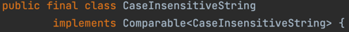
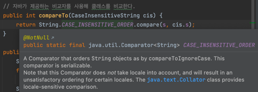
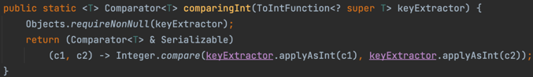
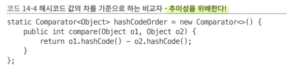
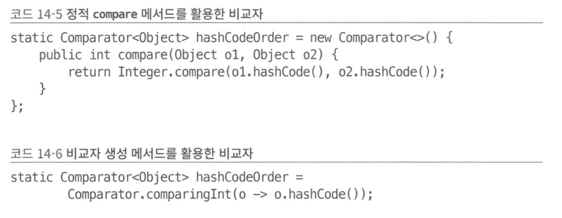

## 아이템 14. Comparable을 구현할지 고려하라

- compareTo는 **단순 동치성 비교 + 순서 비교 + 제네릭**
- Comparable을 구현했다는 것은 그 클래스의 인스턴스들이 자연적인 순서가 있음을 뜻함
- 사실상 자바 플랫폼 라이브러리의 모든 값 클래스와 열거 타입이 Comparable을 구현함

### compareTo 메서드의 일반 규약

- 객체가 주어진 객체보다 작으면 음의 정수, 같으면 0, 크면 양의 정수를 반환, 비교할 수 없는 타입이면 ClassCastException 반환
- sgn: 표현식(음의 정수, 0, 양의 정수를 각각 -1, 0, 1을 반환하도록 정의)
1. Comparable을 구현한 클래스는 모든 x, y에 대해 sgn(x.compareTo(y)) == -sgn(y.compareTo(x))여야 한다. 예외 던질 때는 예외 던져야 함
2. 추이성 보장 → x.compareTo(y) > 0 && y.compareTo(z) > 0 이면, x.compareTo(z) > 0이다.
3. x.compareTo(y) == 0이면 sgn(x.compareTo(z)) == sgn(y.compareTo(z))
4. (x.compareTo(y) == 0) == (x.**equals**(y))
    - 필수는 아니지만 꼭 지키는게 좋음
    - 잘 지키면 compareTo로 줄지은 순서와 equals 결과가 일관됨
    - 일관되지 않은 클래스도 동작은 하지만, 정렬된 컬렉션에 넣으면 해당 컬렉션이 구현한 인터페이스(Collections, Set, Map)에 정의된 동작과 다르게 작동함
        - 이 인터페이스들은 equals 메서드 규약을 따른다고 되어있는데, **정렬된 컬렉션들은 동치성 비교 시 compareTo를 사용함**

- compareTo는 타입이 다른 객체를 신경쓰지 않아도 된다.
    - 타입이 다르면 ClassCastException 던지니까
- equals와 같이 반사성, 대칭성, 추이성 충족해야 함
- 기존 클래스를 확장한 구체 클래스에서 새로운 값 컴포넌트를 추가하면 compareTo 규약을 지킬 방법이 없다.
    - 확장 대신 독립된 클래스를 만들고 이 클래스에 **원래 클래스의 인스턴스를 가리키는 필드**를 두고, **내부 인스턴스를 반환하는 뷰 메서드** 제공

### compareTo 메서드 작성 요령

- Comparable은 타입을 인수로 받는 제네릭 인터페이스이므로 **compareTo 메서드의 인수 타입은** **컴파일 타임**에 정해진다.
    - 입력 인수의 타입을 확인 or 형변환 필요 X
    - 잘못됐으면 컴파일 자체가 안됨
- null을 인수로 넣으면 NullPointerException을 던져야 함

### compareTo를 사용하여 비교하기

- 객체 참조 필드
    - compareTo 메서드 재귀 호출
- Comparable 구현하지 않은 필드 or 표준이 아닌 순서로 비교할 경우
    - Comparator 사용

      

        - CaseInsensitiveString의 참조는 CaseInsensitiveString 참조와만 비교할 수 있다는 뜻
        - Comparable을 구현할 때 일반적인 패턴

      

        - 자바가 제공하는 Comparator

### compareTo를 사용하여 비교하기 - 핵심 필드가 여러 개인 경우

[

- 가장 핵심 필드부터 비교하기
    - 0이 아니면(순서가 결정) 여기서 끝
    - 0이면 그 다음으로 중요한 필드 비교

### compareTo를 사용하여 비교하기 - 비교자 생성 메서드

약간의 성능 저하가 있지만 코드가 훨씬 깔끔하고, 메서드 연쇄 방식으로 비교자 생성하는 방식

- comparingInt

  

    - ToIntFunction: 객체 참조를 int 타입 키에 매핑
    - 매핑한 int 타입 키를 기준으로 **순서를 정하는 비교자**를 반환
    - 코드 설명) PhoneNumber에서 추출한 areaCode를 기준으로 PhoneNumber의 순서를 정하는 Comparator<PhoneNumber>를 반환함
    - 자바가 입력 인수의 타입을 추론할 만큼 강하지 않아서 명시해 줌
- thenComparingInt
    - int 키 추출자 함수를 입력 받아 다시 비교자를 반환
        - 첫 번째 비교자(comparingInt로 반환한 비교자)를 적용한 다음 새로 추출한 키(prefix)로 추가 비교
- 이외에도 float, double용도 있음
    - 자바의 숫자용 기본 타입 모두 커버 가능
- 객체 참조용 비교자 생성 메서드도 있음
    - comparing이라는 **정적 메서드** 2개 다중정의 돼있음
        1. 키 추출자를 받아 그 키의 자연적 순서 사용
        2. 키 추출자 하나와 추출된 키를 비교할 비교자 2개의 인수 받음
    - thenComparing이라는 **인스턴스 메서드** 3개 다중 정의
        1. 비교자 하나만 인수로 받아 그 비교자로 부차 순서(1차, 2차, …) 정함
        2. 키 추출자를 인수로 받아 그 키의 자연적 순서로 보조 순서 정함
        3. 키 추출자 하나와 추출된 키를 비교할 비교자까지 총 2개의 인수 받음

### 값의 차를 기준으로 반환하는 compareTo와 compare

- 사용하면 안됨
- 오버플로, 부동소수점 계산 방식에 따른 오류 가능
- 심지어 빠르지도 않음

대신에 아래 두 개 사용하기

### 핵심 정리

- 순서를 고려해야 하는 값 클래스를 작성한다면 꼭 **Comparable 인터페이스 구현**
    - 인스턴스들을 쉽게 정렬, 검색, 비교 기능을 제공하는 컬렉션과 어우러지도록
- compareTo 메서드에서 필드의 값을 비교할 때 **<와 > 연산자는 쓰지 말기**
- 정적 compare 메서드나 Comparator 인터페이스가 제공하는 비교자 생성 메서드 사용하기