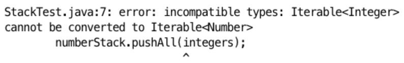
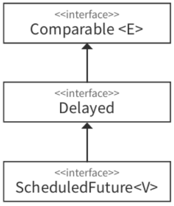

# 한정적 와일드카드를 사용해 API 유연성을 높이라
매개변수화 타입은 불공변이다.
- `List<String>`, `List<Object>`의 관계는 상위/하위 타입이 아님
  - `List<String>`은 `List<Object>`의 일을 제대로 수행하지 못한다. (리스코프 치환 원칙에 어긋남)
  ```java
    public class Stack<E> {
      public Stack();
      public void push(E e);
      public E pop();
      public boolean isEmpty();
    }

    // 와일드카드 타입을 사용하지 않은 pushAll 메소드: 결함이 있음
    public void pushAll(Iterable<E> src) {
      for (E e : src) {
        push(e);
      }
    }

    main {
      Stack<Number> s = new Stack<>();
      Iterable<Integer> integers = ...;
      s.pushAll(integers);
    }
  ```
  
  - Iterable src의 원소 타입이 stack의 원소 타입과 일치하면 잘 작동한다.
  - main 내 코드는 매개변수화 타입이 불공변이기 때문에 에러가 발생한다.
    - 와일드카드 타입으로 해결
      ```java
        public void pushAll(Iterable<? extends E> src) {
          for (E e : src) {
            push(e);
          }
        }
      ```
- 유연성을 극대화하려면 원소의 생산자나 소비자용 입력 매개변수에 와일드카드 타입을 사용하라.
  - 입력 매개변수가 생산자와 소비자 역할을 동시에 한다면 와일드카드 타입을 써도 좋을 게 없다.
    - 타입을 정확히 지정해야 하는 상황으로 와일드카드 타입을 쓰지 말아야 한다.
- `펙스 (PECS): producer-extends, consumer-super`
  - 매개변수화 타입 T가 생산자라면 `<? extends T>`를 사용하고, 소비자라면 `<? super T>`를 사용
  - pushAll은 stack이 사용할 E 인스턴스를 생산하므로 extends를 사용하는 것이 적절
  - popAll은 stack이 stack으로부터 E 인스턴스를 소비하므로 super를 사용하는 것이 적절
- 반환 타입은 한정적 와일드카드 타입을 사용하면 안된다.
  - 클라이언트 코드에서도 반환 타입으로 와일드카드 타입을 써야하기 때문
- 사용자가 와일드카드 타입을 인식하지 않아도 쉽게 사용할 수 있는 API를 제공하는 것이 좋다.
  - 클래스 사용자가 와일드카드 타입을 신경 써야 한다면 API에 문제가 있을 가능성이 크다.

```java
  public static <E> Set<E> union(Set<? extends E> s1, Set<? extends E> s2) {
    // logic
  }

  main {
    Set<Integer> integers = Set.of(1, 3, 5);
    Set<Double> doubles = Set.of(2.0, 4.0, 6.0);
    Set<Number> numbers = union(integers, doubles);
  }
```
- 자바 8에서는 제대로 컴파일 되고, 자바 7에서는 문맥에 맞는 반환 타입을 명시해야 했다.
  - 명시적 타입 인수 사용
  - `Set<Number> numbers = Union.<Number>union(integers, doubles);`

```java
  // public static <E extends Comparable<E>> E max(List<E> c)
  public static <E extends Comparable<? super E>> E max(List<? extends E> c) {
    if (c.isEmpty()) {
      throw new IllegalArgumentException("컬렉션이 비어있습니다.");
    }

    E result = null;
    for (E e : c) {
      if (result == null || e.compareTo(result) > 0) {
        result = Objects.requireNonNull(e);
      }
    }

    return result;
  }
```
- 입력 매개변수에는 E 인스턴스를 생산하므로 extends를 사용했다.
- `Comparable<E>`는 E 인스턴스를 소비하므로 super를 사용한다.

```java
  List<ScheduledFuture<?>> scheduledFutureList = new ArrayList<>();
  max(scheduledFutureList);
```
- 위 코드는 수정된 max 메소드로만 처리가 가능하다.
  - ScheduledFuture 클래스가 `Comparable<ScheduledFuture>`를 구현하지 않았기 때문
  - 수정 전 max 메소드는 Comparable 인터페이스를 구현한 타입만을 처리하려고 한다.
    ```java
      public interface Comparable<E>
      public interface Delayed extends Comparable<Delayed>
      public interface ScheduledFuture<V> extends Delayed, Future<V>
    ```
    
  - ScheduledFuture는 Delayed의 하위 인터페이스이고, Delayed는 `Comparable<Delayed>`를 확장했다.
  - Comparable을 직접 구현하지 않고, 직접 구현한 다른 타입을 확장한 타입을 지원하기 위해 와일드카드가 필요하다.

타입 매개변수와 와일드카드는 공통되는 부분이 있어서 메소드를 정의할 때 둘 중 어느 것을 사용해도 괜찮을 때가 많다.
```java
  public static <E> void swap(List<E> list, int i, int j);
  public static void swap(List<?> list, int i, int j);
```
- public API라면 두 번째가 낫다.
- 어떤 list라도 두 번째 메소드를 사용할 수 있다.
- 기본 규칙으로는 메소드 선언에 타입 매개변수가 한 번만 나오면 와일드카드로 대체하는 것
  - 비한정적 타입 매개변수 -> 비한정적 와일드카드
    - `class Container<T>` -> `class Container<?>`
  - 한정적 타입 매개변수 -> 한정적 와일드카드
    - `class Container<T extends Number>` -> `class Container<? extends Number>`
- 두 번째 코드의 문제
  ```java
    // list.get(i)에서 에러 발생
    public static void swap(List<?> list, int i, int j) {
      list.set(i, list.set(j, list.get(i)));
    }
  ```
  - `List<?>`에는 null 이외의 값을 넣을 수 없다.
  - 와일드카드 타입의 실제 타입을 알려주는 도우미 메소드를 따로 작성하여 해결
    ```java
      public static void swap(List<?> list, int i, int j) {
        swapHelper(list, i, j);
      }

      private static <E> void swapHelper(List<E> list, int i, int j) {
        list.set(i, list.set(j, list.get(i)));
      }
    ```
    - swapHelper 메소드는 list의 타입을 알고 있다.
    - swap을 호출하는 클라이언트는 복잡한 swapHelper의 존재를 모르고 편하게 사용할 수 있다.

## 정리
- 조금 복잡하더라도 와일드카드 타입을 적용하면 API가 훨씬 유연해진다.
- 널리 쓰일 라이브러리를 작성한다면 반드시 와일드카드 타입을 적절히 사용해야 한다.
- 펙스 (PECS): producer-extends, consumer-super
- Comparable, Comparator는 모두 소비자다.
