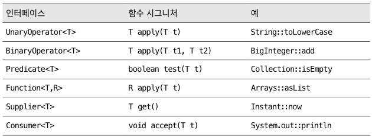

# 표준 함수형 인터페이스를 사용하라
- 자바가 람다를 지원하면서 템플릿 메소드 패턴보다 함수 객체를 매개변수로 받는 생성자와 메소드를 많이 만든다.
- 필요한 용도에 맞는 게 있다면 직접 구현하지 말고 표준 함수형 인터페이스를 활용하자.

## 표준 함수형 인터페이스
- `java.util.function` 패키지 내 함수형 인터페이스
	- 43개의 인터페이스 제공
- 대부분 기본 타입만 지원한다.
	- 기본 함수형 인터페이스에 박싱된 기본 타입을 넣어 사용하지는 말자.
		- 계산량이 많을 때는 성능이 느려질 수 있다.

- `UnaryOperator<T>`: 반환 값과 인수의 타입이 같은 함수 (인수 1개)
- `BinaryOperator<T>`: 반환 값과 인수의 타입이 같은 함수 (인수 2개)
- `Predicate<T>`: 인수 1개를 받아 boolean을 반환하는 함수
- `Function<T, R>`: 인수와 반환 타입이 다른 함수
- `Supplier<T>`: 인수를 받지 않고 값을 반환하는 함수
- `Consumer<T>`: 인수를 하나 받고 반환값은 없는 함수

기본 타입인 int, long, double으로 각각 변형
- ex. IntPredicate, LongBinaryOperator, LongToIntFunction

## 코드를 직접 작성해야할 때
- 표준 인터페이스 중 필요한 용도에 맞는게 없을 때
	- ex. 매개변수 3개를 받는 Predicate
- 구조적으로 똑같은 표준 함수형 인터페이스가 있는 경우
	- `Comparator<T>`는 `ToIntBiFunction<T, U>`와 구조적으로 동일
		1. 자주 쓰이며, 이름 자체가 용도를 명확히 설명해준다.
		2. 반드시 따라야 하는 규약이 있다.
		3. 유용한 디폴트 메소드를 제공할 수 있다.

## @FunctionalInterface
- 직접 만든 함수형 인터페이스에는 항상 `@FunctionalInterface` 어노테이션을 사용하자.
	1. 해당 클래스의 코드나 설명 문서를 읽을 사람에게 람다용으로 설계된 인터페이스임을 알려준다.
	2. 해당 인터페이스가 추상 메소드를 하나만 가지고 있어야 컴파일되게 해준다.
	3. 결과 유지보수 과정에서 누군가 실수로 메소드를 추가하지 못하게 막는다.

## 주의
- 서로 다른 함수형 인터페이스를 같은 위치의 인수로 받는 메소드들을 다중 정의해서는 안된다.
	- 클라이언트에게 불필요한 모호함을 주고, 문제가 일어나기도 한다.
	- ExecutorService의 submit 메소드는 `Callable<T>`를 받는 것과 Runnable을 받는 것을 다중정의 했다.
		- 올바른 메소드를 알려주기 위해 형변환을 할 때가 생긴다.

## 정리
- API를 설계할 때 람다도 염두에 두어야 한다.
- 입력값과 반환값에 함수형 인터페이스 타입을 활용하자.
- 새로운 함수형 인터페이스를 만들어서 쓰는 것이 나을 수도 있다.
