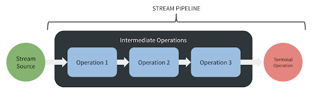

# 스트림은 주의해서 사용하라
- stream api는 자바 8부터 추가
- 스트림 (stream): 데이터 원소의 유한 혹은 무한 시퀀스
- 스트림 파이프라인 (stream pipeline): 이 원소들로 수행하는 연산 단계를 표현하는 개념

## 스트림 파이프라인

- 소스 스트림 -> 중간 연산 -> 종단 연산
- 중간 연산: 스트림을 어떠한 방식으로 변환하는 역할을 수행한다.
  - `filter()`, `map()`, `sorted()`
- 종단 연산: 마지막 중간 연산이 전달하는 스트림에 최후의 연산을 가하는 역할을 수행한다.
  - `forEach()`, `toList()`

```java
  return categoryList.stream()
    .map(CategoryVo::getCategory)
    .toList();
```

### 스트림 파이프라인 특징
스트림 파이프라인은 지연평가 된다.
- 지연 평가: 결과값이 필요할 때까지 계산을 늦추는 기법
- 평가는 stream 형태에서 stream이 아닌 다른 형태의 객체로 바꾸는 행위로 종단 연산에서 수행된다.

스트림 API는 메소드 연쇄를 지원하는 플루언트 API이다.
- 파이프라인 하나를 구성하는 모든 호출을 연결하여 하나의 표현식으로 완성할 수 있다.

스트림 파이프라인은 순차적으로 수행된다.
- 병렬로 실행하려면 파이프라인을 구성하는 스트림 중 하나에서 parallel 메소드를 호출하면 된다.
  - 그런 상황은 많지 않음

스트림을 과하게 사용하면 프로그램이 읽거나 유지보수하기 어려워진다.
- 반복문과 스트림을 적절히 조합하는게 좋음
- 도우미 메소드를 활용하여 적절히 사용하는 것이 좋음

```java
  // stream을 과하게 사용함
  public class Anagrams {
    public static void main(String[] args) throws Exception {
      Path dictionary = Paths.get(args[0]);
      int minGroupSize = Integer.parseInt(args[1]);

      try (Stream<String> words = Files.lines(dictionary)) {
        words.collect(
          groupingBy(word -> word.chars().sorted()
            .collect(StringBuilder::new, (sb, c) -> sb.append((char) c),
            StringBuilder::append).toString()))
        .values().stream()
        .filter(group -> group.size() >= minGroupSize)
        .map(group -> group.size() + ": " + group)
        .forEach(System.out::println);
      }
    }
  }
```

```java
  // 적절히 사용하면 코드가 깔끔해짐
  public class Anagrams {
    public static void main(String[] args) throws Exception {
      Path dictionary = Paths.get(args[0]);
      int minGroupSize = Integer.parseInt(args[1]);

      try (Stream<String> words = Files.lines(dictionary)) {
        words.collect(groupingBy(word -> alphabetize(word)))
        .values.stream()
        .filter(group -> group.size() >= minGroupSize)
        .forEach(g -> System.out.println(g.size() + ": " + g));
      }
    }
  }
```

char 값들을 처리할 때 스트림을 삼가는 편이 낫다.
- 자바가 기본 타입인 char용 스트림을 지원하지 않는다.

```java
  "Hello world!".chars().forEach(System.out::print);

  // 결과로 721011081081113211911111410810033가 출력됨
```
- chars() 메소드가 반환하는 스트림의 원소는 char가 아닌 int다.

```java
  "Hello world!".chars().forEach(x -> System.out.print((char) x));

  // 결과로 Hello world!가 출력됨
```
- 직접 형변환을 해줘야함

## 스트림과 맞지 않는 것들
- 코드 블록에서는 범위 안의 지역변수를 읽고 수정할 수 있다.
  - 하지만 람다에서는 final이거나 사실상 final인 변수만 읽을 수 있고, 지역변수를 수정하는건 불가능하다.
- 코드 블록에서는 return 문을 사용해 메소드에서 빠져나가거나, break나 continue문으로 반복문을 종료하거나 건너뛸 수 있다.
  - 람다로는 불가능
- 코드 블록은 메소드 선언 시 명시된 예외를 던질 수도 있다.
  - 람다로는 불가능

## 스트림과 맞는 것들
- 원소들의 시퀀스를 일관되게 변환한다.
- 원소들의 시퀀스를 필터링한다.
- 원소들의 시퀀스를 하나의 연산을 사용해 결합한다.
- 원소들의 시퀀스를 컬렉션에 모은다.
- 원소들의 시퀀스를 특정 조건을 만족하는 원소를 찾는다.

### 스트림으로 처리하기 어려운 것들
- 한 데이터가 파이프라인의 여러 단계를 통과할 때 각 단계에서의 값들에 동시에 접근하기 어렵다.
  - 하나의 중간 연산을 지나면 원래의 스트림을 잃는 구조로 되어있음
  - 원래 값과 새로운 값의 쌍을 저장하는 방법이 있긴 하다.

## 정리
- 스트림과 반복문 중 어느 쪽이 나은지 확신하기 어렵다면 둘 다 해보고 더 나은 쪽을 택하는 것이 좋다.
  - 가독성이나 성능, 유지보수가 편리한지 확인할 필요가 있다.
