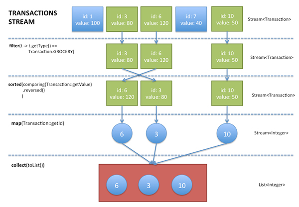

# 스트림 병렬화는 주의해서 사용하라

스트림은 내부 반복자를 사용하므로 병렬 처리가 쉽다

### 스트림 구조


생성 -> 중간연산 -> 최종연산

### 병렬처리 예시

stream에는 parallel로 처리하기 위한 관련 키워드들이 있습니다.

parallel ~

``` java
public static void main(String[] args) {
    
    List<Integer> numbers = Arrays.asList(1, 2, 3, 4, 5, 6, 7, 8, 9, 10);
    // 병렬 스트림 방식
    List<Integer> squaredNumbersParallel = numbers.parallelStream()
                .map(n -> n * 2)
                .map(n -> n * n)
                .collect(Collectors.toList());

    System.out.println(squaredNumbersParallel);
}
```

### 내부반복자란 무엇인가
컬랙션 요소들을 반복하는데, 개발자가 직접 처리하는게 아니라 '동작'만 넘겨주고 대신 처리해주는 방식

내부적으로 fork-join 프레임워크를 사용합니다
- worker 스레드간에 소스 데이터를 분할합니다.
- 작업 완료시 콜백을 처리하는 역할을 합니다. 

### 어떻게 병렬로 처리하는가
1. 분할: 스트림은 작업을 작은 단위로 분할하여 여러 개의 chunk로 나눕니다.
    - [1,2,3,4,5,6,7,8,9] -> [1,2,3] [4,5,6] [7,8,9]
2. 스레드 분배: 각 분할된 chunk를 스레드에 분배합니다.
    - cpu 코어 수, 메모리사용량 등을 고려해서 생성한다는듯.
    - fork-join는 스레드풀을 사용합니다. 기본 스레드 수는 `스레드 수 == 프로세서 코어 수`
    - 다음 환경변수로 jvm 설정도 가능 `-D java.util.concurrent.ForkJoinPool.common.parallelism=4`
3. 병합: 각 서브태스크의 결과를 합치는 과정으로, 분할된 작업의 결과를 모아 최종 결과를 생성합니다.

### 고려해야하는 상황
책에서 다룰 내용이지만, 병렬 처리에 적합하지 않거나 너무 간단한 작업의 경우 오히려 성능이 저하됩니다.
- 메모리 지역성
- 위의 분할 및 병합에 대한 cost

---

### 책에서 나온 코드


``` java
public static void main(String[] args) {
    primes().map(p -> TWO.pow(p.intValueExact()).subtract(ONE))
            .filter(mersenne -> mersenne.isProbablePrime(50))
            .limit(20)
            .forEach(System.out::println);
}
static Stream<BigInteger> primes() {
    return Stream.iterate(TWO, BigInteger::nextProbablePrime);
}

```

책에서는 몇시간 지나도 안나온다고 했는데, jdk17 + m1 실리콘이 쩔어서일까. 결과 5초만에 나오더라.

이게 중요한게아니고..

- 데이터 소스가 Stream.iterate 라면 병렬처리로 성능 개선을 기대할 수 없다.
  - 
- 중간 연산으로 limit 이 사용되고 있다면 병렬처리로 성능 개선을 기대할 수 없다.

-> 근데 이유가 뭐지?

### 병렬 처리가 효율적인 자료구조

ArrayList, HashMap, HashSet, ConcurrentHashMap, 배열, int, long

- 메모리에서의 공간 지역성이 좋음.
  - 캐시 메모리로의 로딩까지 스레드가 멍때려야함
- 원하는 크기로 명확하게 나눌 수 있음
  - 따라서 chunk 분리와 스레드에 분배에 적합

Case: ArrayList나 배열은 인덱스로 요소를 관리해 분리가 쉽지만 LinkedList는 분할을 위해서는 모두 탐색을 해야 하기 때문에 느릴 수 있다.

### 병렬처리에 적절한 최종연산(종단연산)

1. 최종 연산 중 '축소'연산
- 축소 연산: 최종 연산 결과를 하나로 만드는 것 (즉 컬랙션은 아님)
- reduce, min, max, count, sum, average 등등.

2. 조기 종료 가능한 연산
- anyMatch, allatch, noneMatch:

> 개발자가 직접 구현한 Stream, Iterable, Collection에서 는 spliterator 를 재정의해야한다.

### 그럼 씨 어떨때 스트림 병렬 처리를 하라는기고?

아직도 감이 안옵니다.

실제 비즈니스 상황에서 케이스가 있을까요?

대용량 데이터 연산 쪽에서만 자주 쓰이는걸까요?

### 꼭 읽어보시면 좋을법한 추천 레퍼런스

https://girawhale.tistory.com/131
