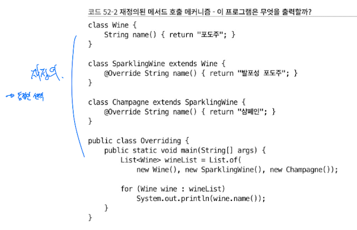
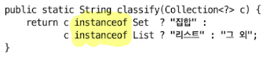
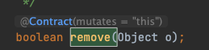
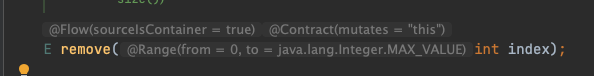

# 다중정의는 신중히 사용하라


> 출력결과: 그 외 그 외 그 외

### overload(다중 선택)에서 뭐가 정적인 선택이라는 것일까
세 개의 매서드 중 어떤 것을 고를 것인가

-> 런타임이 아닌 컴파일 타임에 결정.

즉 ! 컴파일 시점에는 `Collection<?>` 이기 때문에, 가장 마지막 매서드가 호출이 되는 것.

### 그렇다면 override(재정의)는 어떨까



> 출력결과: 포도주, 발표성 포도주, 샴페인

솔직히 override는 런타임에 결정되기 때문에, 관련이 없다.

> 솔직히 이 Override 내용은 동적/정적 판단 때문에 조금 억지로 넣은게 아닌가 싶다. 내용이 그닥 잘 연결되지 않음.

### 다중선택에서 일어나는 문제의 해결방법은?

1. 기존 다중선택을 없애버리고, 하나의 매서드로 만드는 방식


2. 매서드 이름을 지정해주는 방식


> 결국 다중선택을 하지 말라는 것 인데, 사실 해당 문제의 근본적인 해결책은 아니다.

### 실제 문제가 발생하는 case: list.remove()

``` java
class Test {
    public static void main(String[] args) {
        Set<Integer> set = new TreeSet<>();
        List<Integer> list = new ArrayList<>();
        for (int i = -3; i < 3; i++) {
            set.add(i);
            list.add(i);
        }
        for (int i = 0; i < 3; i++) {
            set.remove(i);
            list.remove(i);
        }
        System.out.println(set + " " + list);
    }
}
```

```
> Task :Test.main()
[-3, -2, -1] [-2, 0, 2]
```

내부에 보면 remove 가 두 개 선언되어 있다.

- 객체 overload (해당 객체 삭제)

    

- 정수 리터럴 overload (n번째 아이템 삭제)

    

그래서 i 가 리터럴이라 i 번째 아이템을 삭제해버린다 ~ !

그래서 다음과 같이 타입 캐스팅을 해줘야한다.
``` java
for (int i = 0; i < 3; i++) {
    set.remove(i);
    list.remove((Integer)i);
}
```


### review
> 프로그래밍 언어가 다중정의를 허용한다고 해서 다중정의를 꼭 활용하란 뜻은 아니다. 일반적으로 매개변수 수가 같을 때는 다중정의를 피하는 게 좋다.

- 개인적으로 내용이 매끄러운 챕터는 아니었던 것 같다. 억지로 다른 개념을 가져와서 비교하려는 느낌이 강했음
- 그렇지만 모른다면 충분히 실수 가능한 챕터이기 때문에 챕터 색상이 빨간색이지 않을까? 생각보다 어려운 내용은 없었다.
- 아마 초기 아이템에서도 나왔지만, 오버로딩을 사용하는 것은 가독성을 해치거나 휴먼 에러를 발생시킬 수 있겠다.
- 이런 부분에서 문제가 발생하지 않게 하기 위해서 케이스를 잘 기억해야 할 것 같다. 충분히 나올만한 케이스라고 느꼈음.
- 테스트코드 잘 짜야겠구나.
