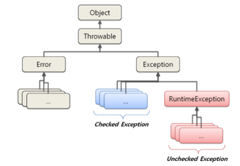

# item70 복구할 수 있는 상황에는 검사 예외를 프로그래밍 오류에는 런타임 예외를 사용하라.

## 검사 예외(CheckedException)

**호출하는 쪽에서 복구하리라 여겨지는 상황이면 검사 예외를 사용하라.**

- 실행하기 전에 예측 가능한 예외들 → 컴파일 시점
- 체크 예외가 발생하는 메소드를 호출자가 try-catch로 잡거나, throws로 바깥으로 전파하도록 **강제화** 할 수 있다.
- API 사용자에게 예외 발생을 알려줄 수 있다.
- 예외 발생 시 트랜잭션을 롤백하지 않음.
- ex) IOException, SQLException

---

## 런타임 예외(UnCheckedExcepion)

**프로그램 오류를 나타낼 때는 런타임 예외를 사용하라.**

(비검사 throwable은 런타임 예외와 오류를 의미)

- 실행하고 난 후 알 수 있는 예외들 → 런타임 시점
- 대부분 클라이언트가 API 명세 제약을 지키지 못해 발생한다.
- 예외를 처리할 필요가 없거나 혹은 통상적으로 잡지 말아야 한다.
- 예외 발생 시 트랜잭션을 롤백 함.
- ex) NullPointerException, ArrayIndexOutOfBoundException

---

## 에러(Error)

- 실행 중 발생할 수 있는 치명적 오류를 의미 → 컴파일 시점
  (보통 JVM이 자원부족, 불변식 깨짐 등 더 이상 작업을 수행할 수 없는 상황)
- 오류 발생 시 프로그램은 비정상 종료 된다.
- throwable, Error 클래스 상속도 하지말고, Error 클래스를 throw 문으로 던져도 안된다.
  → 비검사 throwable은 RuntimeException 하위 클래스를 사용하라.