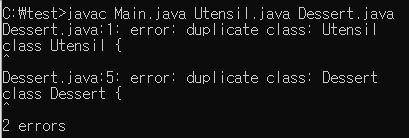

# 톱 레벨 클래스는 한 파일에 하나만 담으라(담아라?)

### 톱 레벨 클래스란?
* **중첩 클래스가 아닌 클래스**를 의미한다.
* 그럼 중첨 클래스란?
  * 다른 클래스/인터페이스 내부에 선언된 클래스를 의미한다.

### 어떤 문제가 있을까?
```java
//Main.java
public class Main {
    public static void main(String[]args){
        System.out.println(Utensil.NAME + Dessert.NAME);
    }
}
```
```java
//Utensil.java
class Utensil {
    static final String NAME = "pan";
}
class Dessert {
    static final String NAME = "cake";
}
```
```java
//Dessert.java
class Utensil {
    static final String NAME = "pot";
}

class Dessert {
    static final String NAME = "pie";
}
```
* `Utensil.java`, `Dessert.java`가 어떤 순서에 따라 컴파일(javac)되냐에 따라 결과가 달라진다.
  * Main -> Utensil -> Dessert(**중복 정의!**)
    
* 인텔리제이 등의 IDE는 이를 미리 잡아주긴 함.

### 그럼 어떻게?
1. 톱 클래스를 한개의 파일에 위치 시킨다.
2. 정적 멤버 클래스를 사용한다.(다른 클래스에 딸린 부가적인 클래스인 경우)
```java
//정적 멤버 클래스 사용
public class Main {
    public static void main(String[]args){
        System.out.println(Utensil.NAME + Dessert.NAME);
    }
    private static class Utensil{
        static final String NAME  = "pan";
    }
    private static class Dessert{
        static final String NAME = "cake";
    }
}
```
