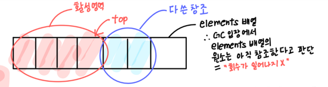

## 아이템 7. 다 쓴 객체 참조를 해제하라

- 가비지 컬렉터 있으니까 메모리 관리 신경 안써도 된다? → 절대 아님

### 스택

```java
public class Stack {
    private Object[] elements;
    private int size = 0;
    private static final int DEFAULT_INITIAL_CAPACITY = 16;

    public Stack() {
        elements = new Object[DEFAULT_INITIAL_CAPACITY];
    }

    public void push(Object e) {
        ensureCapacity();
        elements[size++] = e;
    }

    public Object pop() {
        if (size == 0)
            throw new EmptyStackException();
        return elements[--size]; // 그저 elements 반환만 함
    }

    /**
     * 원소를 위한 공간을 적어도 하나 이상 확보한다.
     * 배열 크기를 늘려야 할 때마다 대략 두 배씩 늘린다.
     */
    private void ensureCapacity() {
        if (elements.length == size)
            elements = Arrays.copyOf(elements, 2 * size + 1);
    }
}
```



- 스택에서 꺼내진 객체들을 가비지 컬렉터가 회수하지 않는다.
    - 다 쓴 참조(obsolete reference)를 여전히 가지고 있기 때문
        - 다 쓴 참조: 앞으로 다시 쓰지 않을 참조
- **객체 참조 하나 살려두면 그 객체가 참조하는 모든 객체를 회수하지 못함**
    - 단 몇 개의 객체가 매우 많은 객체를 회수하지 못하게 할 수 있음
    - 잠재적 악영향 끼침
- 그래서 어떻게 해결?
    - **해당 참조를 다 썼을 때 null 처리**하면 된다.

    ```java
    public Object pop() {
        if (size == 0)
            throw new EmptyStackException();
        Object result = elements[--size];
        elements[size] = null; // 다 쓴 참조 해제
        return result;
    }
    ```

    - 이렇게 짜면 심지어 **null 처리한 참조를 실수로 사용**하려 할 때 **NullPointerException**을 던짐
- null 처리를 계속 해주면 코드가 더러워지지 않나?
    - 객체 참조를 null 처리하는 일은 **예외적인 경우**여야 한다.
    - 가장 좋은 방법은 **그 참조를 담은 변수를 유효 범위(scope) 밖으로 밀어내는 것**
    - 변수의 범위를 최소가 되게 정의하면 됨
- 위의 스택 클래스는 자기 메모리를 직접 관리하기 때문에 메모리 누수에 취약하다.
    - Object 배열인 elements로 **객체의 참조를 담은 저장소 풀**을 만들어 원소들을 관리하기 때문
- 캐시
    - 객체 참조를 캐시에 넣고 까먹음
    - 캐시 외부에서 키를 참조하는 동안만 엔트리가 살아있는 캐시가 필요한 상황인 경우에만, WeakHashMap을 사용해 캐시 만들면 다 쓴 엔트리는 자동으로 제거됨
        - Weak Reference: null이면 GC 대상
    - 보통 캐시 엔트리의 유효 기간을 정확히 정의하기 어렵기 때문에 시간이 지날수록 엔트리의 가치를 떨어뜨리는 방식 사용
        - ScheduledThreadPoolExecutor 같은 백그라운드 스레드 활용
        - 캐시에 새 엔트리 추가 시 부수 작업(엔트리 청소)으로 수행
        - java.lang.ref 활용
- 리스너, 콜백
    - 클라이언트가 콜백을 등록만 하고 해지하지 않음
    - 콜백을 약한 참조로 저장하면 됨 - WeakHashMap에 키로 저장

### 정리

- 예방법을 미리 익혀두는게 중요하다

